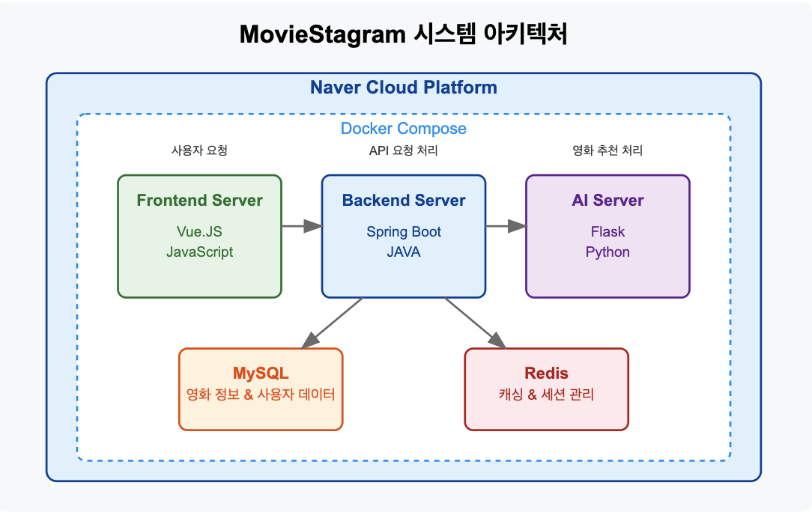
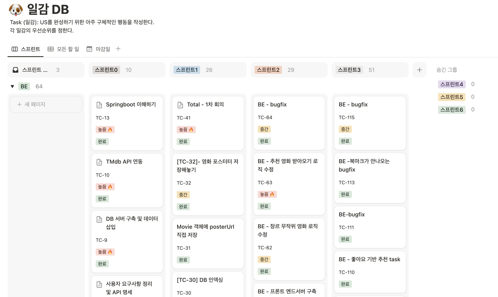
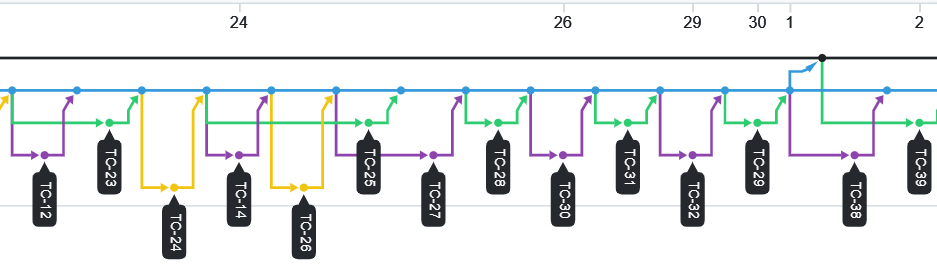

# 2024-1 SE-TeamProject  MovieStagram 🎬

2024-1 경기대학교 소프트웨어공학 팀프로젝트 5조 백엔드 레포지토리입니다!

---
### 프로젝트 목적 🔮
유저가 좋아할 만한 영화를 instagram처럼 게시물 형태로 보여줌으로써
영화를 추천하는 웹 서비스

---

### 기술 스택 💻

---

### 소프트웨어 구성도 🏗️

#### 시스템 구성
- **프론트엔드 서버**: Vue.JS 기반 웹 애플리케이션
- **백엔드 서버**: Spring Boot 기반 RESTful API 서버
- **AI 서버**: Flask 기반 영화 추천 엔진

#### 서비스 흐름
1. 사용자는 프론트엔드를 통해 영화 정보 및 추천 요청
2. 프론트엔드 서버는 백엔드 API 서버로 요청을 전달
3. 백엔드 서버는 필요한 경우 AI 서버에 영화 추천 관련 요청을 전달
4. AI 서버는 추천 결과를 백엔드 서버에 반환
5. 백엔드 서버는 최종 결과를 프론트엔드로 전달하여 사용자에게 표시

#### 배포 환경
모든 서버 컴포넌트는 NCP(Naver Cloud Platform)에 Docker-compose를 통해 배포되어 안정적인 운영 환경을 제공합니다.

### 프로젝트 개발 프로세스 🔄

#### 애자일 방법론 적용
- **스프린트 기반 개발**: 프로젝트를 4개의 스프린트로 나누어 점진적으로 기능을 구현했습니다.
- **데일리 스크럼**: Discord를 통해 매일 진행 상황을 공유하고 장애물을 해결했습니다.
- **스프린트 회고**: 각 스프린트 종료 시 팀원들과 함께 회고를 진행하여 개선점을 도출했습니다.

#### Notion을 활용한 태스크 관리

- **스프린트 보드**: 스프린트별로 할당된 태스크를 시각적으로 관리했습니다.
- **태스크 카드(TC)**: 각 작업에 고유 TC 번호를 부여하여 코드 커밋과 연결했습니다.
- **상태 추적**: 작업 상태(할 일, 진행 중, 완료)를 실시간으로 업데이트하여 프로젝트 진행 상황을 한눈에 파악했습니다.
- **우선순위 설정**: 🔥 태그를 통해 중요도와 우선순위를 표시했습니다.

#### GitHub 브랜치 전략

- **Git Flow 기반 브랜치 정책**: 
  - `main`: 배포 가능한 안정적인 코드 브랜치
  - `develop`: 개발 통합 브랜치
  - `feature/TC-XX`: 각 기능 개발 브랜치
  - `bugfix/TC-XX`: 버그 수정 브랜치

- **PR 규칙**: "[Task ID] - 구현 내용" 형식으로 PR 제목 작성
- **코드 리뷰**: 모든 코드 변경은 팀원의 리뷰 후 develop 브랜치에 병합

#### 배포 규칙
- **정기 배포**: 스프린트 완료 시 진행
- **Docker 컨테이너화**: 일관된 실행 환경 보장
- **환경 분리**: 개발 환경과 테스트 환경 분리

---
### 주요 기능 🚀
- 영화 정보 검색 및 조회
- 사용자 맞춤형 영화 추천
- 영화 리뷰 및 평점 관리
- TMDb API 연동
- 사용자 요구사항 분석 및 RESTful API 설계

---
### PR 시 유의 사항 ‼️
- "[Task ID] - 구현 내용" 으로 commit 및 PR 올리기!
- main branch가 아닌 develop branch에 PR 올리기!
